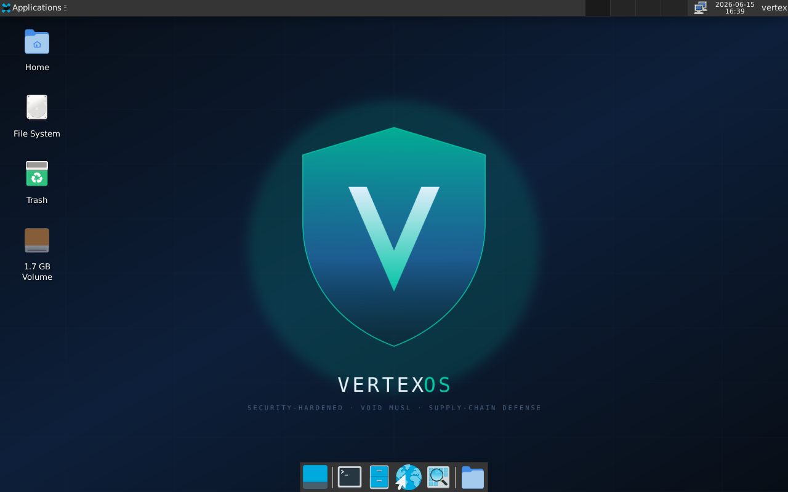
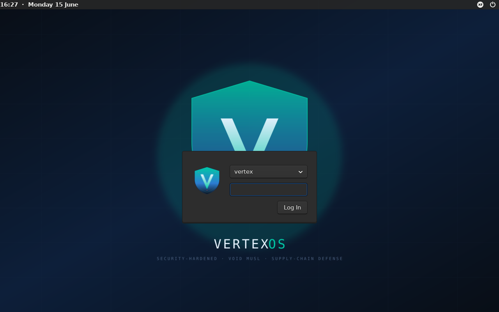
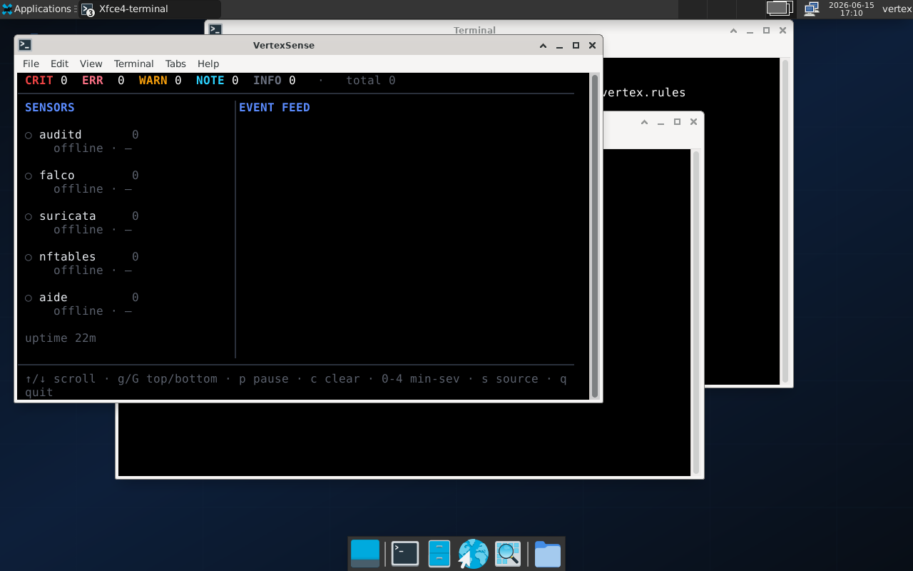

<div align="center">

# VertexOS

### The Linux desktop you can safely run coding agents and untrusted dependencies on.

Security-hardened · **Void Linux (musl)** · supply-chain & agent-abuse defense — *enforced from boot, not bolted on.*

[](https://github.com/VertexElite/vertexos/releases/latest)
[](#%EF%B8%8F-validated--white-team-pass-1010)




</div>

---

## Why VertexOS

Modern dev machines run a coding agent that can read your whole home directory, and pull
hundreds of dependencies whose post-install scripts run as you. One malicious `npm`
post-install, one prompt-injected `CLAUDE.md`, one rogue MCP server — and the attacker is
*already you*, on your box.

Most "hardened" distros ship the rules but leave the enforcement to you. VertexOS takes one
opinionated stance: **the hardening, the sensors, and the deny-by-default posture ship as the
default and arm themselves at boot.** Then it proves they actually work — adversarially.

> **Mission:** be the box where a compromised dependency or a misbehaving agent gets
> *detected and contained*, visibly, instead of silently owning you.

---

## ✨ Highlights

- 🧱 **Void Linux musl** base — no glibc CVE class, rolling, independent, `runit` init
- 🛡️ **KSPP-hardened kernel** (6.18) + a full sysctl hardening drop-in, applied at boot
- 🔒 **AppArmor enforcing** — 74 profiles in *enforce* mode (not complain)
- 🚧 **nftables default-deny — inbound *and* egress** — outbound C2/exfil is dropped + logged
- 👁️ **auditd-native detection** — agent-credential, package-manager, identity, persistence and
  kernel-module events tagged with `vertex_*` keys and streamed live
- 📟 **VertexSense** — a Go TUI that aggregates the sensors into one live dashboard
- 🤖 **`vtx-sandbox`** — an AppArmor jail to run an agent with cred-store reads and persistence
  writes *denied*, workspace + network *allowed*
- 🔁 **`vtx-secarm`** — a resilient one-shot that arms every sensor at boot so one bad rule can
  never silently disarm the box
- 📡 **CVE Watch** — a daily GitHub Action that flags actively-exploited CVEs hitting the shipped stack
- ✅ **Adversarially validated** — a white-team red/blue test scores **10/10** from a cold boot

---

## 🖥️ Screenshots

| Greeter | Live security telemetry |
|---|---|
|  | `VertexSense` (live `-demo` shown below) |

```
 ◆ VertexSense  ·  VertexOS security telemetry
 CRIT 1  ERR 2  WARN 4  NOTE 2   ·   total 9
─────────────────────────────────────────────────────────────────────────────
 SENSORS              │ EVENT FEED
 ● auditd             │ CRIT falco    Terminal shell in container
 ○ falco              │ ERR  suricata ET SCAN Potential SSH Scan  203.0.113.7 -> 10.0.0.5
 ○ suricata           │ NOTE nftables nft-drop  198.51.100.9 -> 10.0.0.5 dpt 23
 ● nftables           │ WARN falco    Write below /etc  (/etc/crontab)
 ● aide               │ ERR  aide     removed: /usr/bin/sudo
                      │ WARN nftables nft-drop  192.0.2.44 -> 10.0.0.5 dpt 3389 (scan)
 ↑/↓ scroll · p pause · 0-4 min-sev · s source · q quit
```

---

## ✔️ Validated — white-team PASS 10/10

VertexOS is tested the way it'll be attacked. A red/blue exercise runs **as an unprivileged
user** (simulating a compromised dependency or coding-agent), fires ten supply-chain /
agent-abuse vectors, and the blue side scores each against the live sensors — on a **cold boot,
with zero manual setup**:



| # | Attack vector | Result |
|---|---|---|
| V1 | Agent-config tamper (`.claude/settings.json`, `.mcp.json`, `CLAUDE.md`) | ✅ detected |
| V2 | Home persistence write (`~/.bashrc`, autostart) | ✅ detected |
| V3 | Package-manager exec (supply-chain post-install) | ✅ detected |
| V4 | Identity tamper (`/etc/shadow`) | ✅ detected |
| V5 | Kernel-module load (rootkit pattern) | ✅ detected |
| V6 | Outbound C2 / exfil | ✅ **blocked** (egress default-deny) |
| V7 | Unprivileged user-namespace LPE | ✅ **blocked** |

**`RESULT: PASS=10  MISS=0  GAP=0`** — engines: `auditd` + `nftables` + `apparmor` (74 enforce).

> The first run of this test found *every* defense shipped **disarmed** (`PASS=0`) due to wiring
> bugs — that's exactly what an adversarial test is for. Nine defects were fixed and the box now
> arms itself correctly from boot. See the release notes for the full story.

---

## 🔒 Security model — the layers

| Layer | What ships | Enforces |
|---|---|---|
| **Kernel** | Void `linux` 6.18, every KSPP flag (`HARDENED_USERCOPY`, `SLAB_FREELIST_HARDENED`, `FORTIFY_SOURCE`, `STACKPROTECTOR_STRONG`, KPTI) | memory-safety mitigations |
| **sysctl** | `kptr_restrict=2`, `dmesg_restrict`, `unprivileged_bpf_disabled`, `yama.ptrace_scope=2`, `perf_event_paranoid=3`, `user.max_user_namespaces=0`, `kexec_load_disabled`, full `fs.protected_*` + net anti-spoof | LPE & info-leak surface |
| **MAC** | AppArmor, 74 profiles **enforcing**; `vtx-sandbox` for agents | confinement |
| **Firewall** | nftables, default-deny **in + out**, drops logged (`vtx-drop` / `vtx-egress-drop`) | exfil / C2 / scan |
| **Audit** | `auditd` + `vertex_*` rules on agent creds, pkg-mgrs, identity, persistence, modules | detection / DFIR |
| **Integrity** | AIDE baseline + `vtx-aide` service | tamper detection |
| **USB** | usbguard default-block (BadUSB / HID-injection) | peripheral attacks |
| **Boot** | `rd.shell=0 rd.emergency=halt panic=10`, signed-boot tooling (`sbctl`) | initramfs bypass |
| **Arm** | `vtx-secarm` one-shot loads every rule resiliently at boot | *no silent disarm* |

Deep dives: [threat model](docs/threat-model.md) · [supply-chain defense](docs/supply-chain-defense.md) · [CVE mitigation matrix](docs/cve-mitigation-matrix.md) · [kernel config](docs/kernel-config.md)

---

## 🚀 Quick start

**1. Download** the latest ISO from [Releases](https://github.com/VertexElite/vertexos/releases/latest).

**2. Verify it** (always — a hardened OS you didn't verify is theatre):
```bash
sha256sum -c SHA256SUMS
# vertexos-0.1.0-alpha-x86_64-musl.iso: OK
```

**3. Write to USB** and boot it, or try it in a VM:
```bash
# USB (replace sdX with your stick — this erases it)
sudo dd if=vertexos-0.1.0-alpha-x86_64-musl.iso of=/dev/sdX bs=4M status=progress oflag=sync

# or QEMU
qemu-system-x86_64 -enable-kvm -m 4G -cdrom vertexos-0.1.0-alpha-x86_64-musl.iso
```
…or point VirtualBox/Ventoy at the ISO. **Live login:** `vertex` / `vertex`.

---

## 💿 Install to disk

Boot the live ISO, open a terminal, and run:
```bash
sudo void-installer
```
Set your own username + password during install (the live `vertex/vertex` is live-only). After
first boot, confirm the hardening:
```bash
sudo /usr/share/vertexos/audits/run-all.sh
```

---

## 🤖 Run an agent safely (the whole point)

VertexOS ships `vtx-sandbox` — an AppArmor profile that lets you run a coding agent with the
dangerous paths denied:

```bash
# cred stores + persistence writes DENIED; workspace + network ALLOWED
vtx-sandbox claude
vtx-sandbox npm install      # an evil post-install can't read ~/.ssh or write autostart
```

If a dependency or a prompt-injected context tries to read `~/.aws/credentials`, write
`~/.config/autostart`, or beacon out to a non-allow-listed host — it's **denied and logged**,
and the event shows up in VertexSense.

---

## 📡 VertexSense — live security telemetry

A `bubbletea` TUI that tails the sensors and renders one dashboard (severity counts · sensor
sidebar · scrollable event feed · filters).

```bash
vertexsense              # live: tails auditd / nftables / AIDE
vertexsense -demo        # synthetic feed, no live sensors needed (great for a first look)
vertexsense -snapshot    # render one frame to stdout (no TTY) — for screenshots / CI
```

Collectors: `auditd` (primary host engine), `nftables` kernel-log drops, AIDE reports, with
Falco/Suricata JSON wired for when those packages land.

---

## 🔭 CVE Watch — daily exploited-CVE radar

A scheduled GitHub Action (`.github/workflows/cve-watch.yml`) pulls the **CISA KEV** catalog
(actively-exploited "triggering" CVEs) + recent NVD, matches them against the shipped stack, and
cross-references the mitigation matrix — committing a dated report to
[`docs/cve-watch/`](docs/cve-watch/). Run it yourself:

```bash
python3 tools/cve-watch/cve-watch.py     # stdlib only
```

Each hit is classified 🔴 *urgent* (recently weaponized, not yet mitigated) · 🟡 *backlog* ·
🟢 *tracked* · ⚪ *N/A — we don't ship the component*.

---

## 🧪 Audit your own hardening

Self-check scripts ship in the image and the repo:
```bash
sudo /usr/share/vertexos/audits/run-all.sh
# 01-kernel-hardening · 02-apparmor-coverage · 03-network-exposure · 04-privesc-paths
```

---

## 🪟 Run VertexOS in WSL (dev surface)

You can import the userland as a WSL2 distro for convenience (GUI apps render via WSLg):
```powershell
wsl --import VertexOS-Live C:\WSL\VertexOS E:\path\vertexos-rootfs.tar
wsl -d VertexOS-Live
```
> ⚠️ WSL runs **Microsoft's kernel**, so the LSM-level defenses (`auditd`, AppArmor) and the
> runit-supervised sensors **don't apply** — WSL is a fine dev/UI surface, but the real hardened
> posture lives on the ISO/VM.

---

## 🔨 Build from source

Requires Docker + ~4 GB RAM/disk. GitHub-hosted runners build it on every push
([`.github/workflows/build-iso.yml`](.github/workflows/build-iso.yml)).

```bash
git submodule update --init build/void-mklive   # REQUIRED
docker build -f build/Containerfile.vertex -t vertexos-builder:latest .
./build/mklive-wrapper.sh -o vertexos.iso
# -> build/out/vertexos.iso
```

---

## 📁 Repo layout

```
build/        ISO build wrapper + void-mklive submodule + rootfs overlay
kernel/       Hardened sysctl drop-ins + custom kernel config (planned)
packages/     VertexOS-specific srcpkgs (XBPS templates)
security/     AppArmor profiles, nftables, Falco/Suricata/AIDE rule-sets
ui/           XFCE defaults, Aero-Glass theme, wallpapers, greeter
installer/    Calamares branding + post-install hooks
vertexsense/  Go security-telemetry TUI (collectors + dashboard + tests)
tools/        cve-watch pipeline
docs/         threat model, CVE matrix, supply-chain defense, audits, cve-watch
```

---

## 🗺️ Roadmap

- [x] ISO build pipeline + hardened overlay
- [x] auditd-native detection + VertexSense
- [x] nftables default-deny in/out + AppArmor enforce + `vtx-secarm`
- [x] White-team red/blue validation (PASS 10/10)
- [x] Daily CVE-watch pipeline
- [ ] Package Falco / Suricata as the kernel-engine tier
- [ ] `vtx-sandbox` auto-wrap for agents + FUSE context-seal
- [ ] UKI + TPM-PCR-sealed LUKS (Phase 1.5)
- [ ] `ZERO_CALL_USED_REGS` custom kernel srcpkg

---

## 🔐 Coordinated disclosure

Found a security issue in VertexOS? Please report privately — see `SECURITY.md` (or open a
minimal advisory via GitHub Security Advisories). Responsible disclosure appreciated.

## 📜 License

Kernel + userland stay under their upstream licenses (GPL etc.). VertexOS-specific code
(overlay, `vertexsense`, `cve-watch`, audits) is **MIT**.

---

<div align="center">
<sub>VertexOS — built by <b>VertexElite</b> · <i>the box you can safely run agents on</i> 🛡️</sub>
</div>
